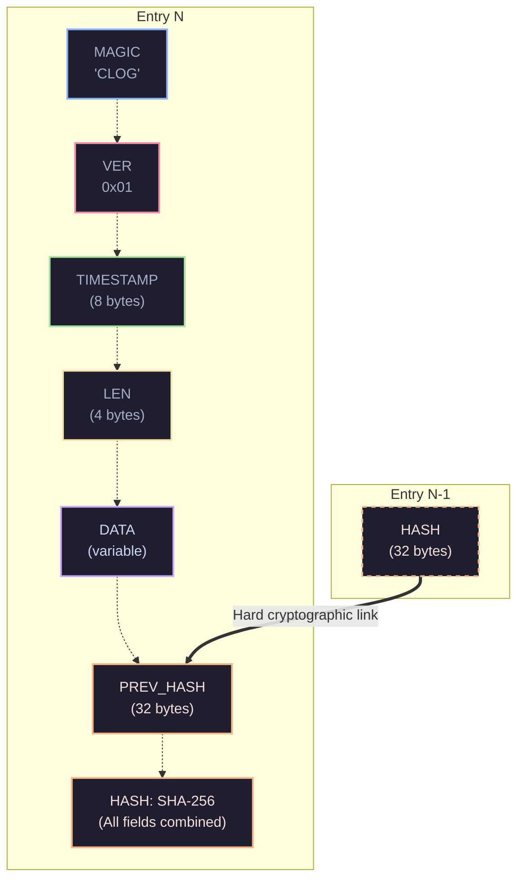

<p align="center">
  
  
  
  
</p>

<h1 align="center">🔐 cryptlog</h1>

<p align="center">
  <strong>A tamper-evident, append-only log using SHA-256 hash chains.</strong><br>
  <sub>Think git commits, but for audit trails. If someone changes a single byte, you'll know exactly where.</sub>
</p>

<p align="center">
  <a href="#-why-cryptlog">Why?</a> •
  <a href="#-install">Install</a> •
  <a href="#-quick-start">Quick Start</a> •
  <a href="#-commands">Commands</a> •
  <a href="#-use-as-a-library">Library</a> •
  <a href="#-binary-format">Format</a> •
  <a href="#-security-model">Security</a> •
  <a href="#-license">License</a>
</p>

---

## 🤔 Why cryptlog?

Most log files are just text. Anyone with write access can silently edit or delete records — and you'd never know.

**cryptlog** solves this with a dead-simple idea: every entry includes the SHA-256 hash of the previous one. Change any past record, and the chain breaks *at exactly that point*.

```
entry 0 ──hash──▶ entry 1 ──hash──▶ entry 2 ──hash──▶ entry 3
                                       ▲
                                   tamper here
                                       │
                               verify catches it ✗
```

> **No database. No server. No blockchain network.**  
> Just a single binary file with cryptographic integrity you can verify offline.

<p align="center">
  
</p>

### When to use it

| Scenario | How cryptlog helps |
|---|---|
| 🏛️ **Compliance & auditing** | Prove records weren't altered after the fact |
| 🔍 **Incident forensics** | Trustworthy timeline of what happened and when |
| 🎓 **Academic records** | Detect unauthorized grade or fee modifications |
| 🧾 **Financial trails** | Immutable record of transactions and approvals |
| 🐛 **Debug journals** | Append-only traces that can't be silently edited |
| 📦 **Chain of custody** | Verify a sequence of events was never reordered |

---

## 📦 Install

### From Cargo (CLI)

```bash
cargo install cryptlog
```

### From source (development)

```bash
git clone https://github.com/YOUR_USERNAME/cryptlog.git
cd cryptlog
cargo install --path .
```

### Or build manually

```bash
cargo build --release
# binary is at ./target/release/cryptlog
```

> **Requirements:** Rust 1.70+ (stable)

---

## ⚡ Quick Start

```bash
# 1. append some audit entries
cryptlog append "user:42 logged in from 192.168.1.1"
cryptlog append "user:42 deleted invoice:991"
cryptlog append "admin:01 exported all records"

# 2. verify the chain — are all records untouched?
cryptlog verify
# ✓ chain intact — 3 entries verified

# 3. view recent entries
cryptlog tail
```

**Output:**

```
cryptlog audit.clog (showing last 3)

  #      timestamp                    message                                       hash
  ──────────────────────────────────────────────────────────────────────────────────────────
  0      2026-03-26 16:24:57.936      user:42 logged in from 192.168.1.1            d656fc0f93ee
  1      2026-03-26 16:24:57.945      user:42 deleted invoice:991                   30b8067ccedd
  2      2026-03-26 16:24:57.955      admin:01 exported all records                 abfb117724bb

  total: 3
```

### 💥 Tamper detection in action

```bash
# tamper with the log file
printf '\x00' | dd of=audit.clog bs=1 seek=50 count=1 conv=notrunc 2>/dev/null

# try to verify again
cryptlog verify
# verifying 3 entries... TAMPERED
#   ✗ chain broken at entry 0
#   ! entries before 0 are valid, entry 0 and beyond are suspect
```

> **One flipped byte. Caught instantly.** That's the whole point.

---

## 🛠️ Commands

| Command | Description | Exit Code |
|---|---|---|
| `cryptlog append <message>` | Append a new entry to the log | `0` |
| `cryptlog verify` | Verify the entire hash chain | `0` intact, `2` tampered |
| `cryptlog tail [n]` | Show last *n* entries (default: 10) | `0` |
| `cryptlog range <from_ms> <to_ms>` | Show entries in a unix timestamp range (ms) | `0` |
| `cryptlog snapshot` | Export hash anchor for external storage | `0` |
| `cryptlog check-snapshot <snap>` | Verify log against a saved snapshot | `0` match, `2` mismatch |
| `cryptlog count` | Print total entry count | `0` |
| `cryptlog help` | Show usage information | `0` |

### Environment Variables

| Variable | Default | Description |
|---|---|---|
| `CRYPTLOG_PATH` | `audit.clog` | Path to the log file |

```bash
# use a custom log file
CRYPTLOG_PATH=/var/log/myapp.clog cryptlog append "system started"
CRYPTLOG_PATH=/var/log/myapp.clog cryptlog verify
```

---

## 📚 Use as a Library

cryptlog is both a CLI tool **and** a Rust library. Add it to your project:

```bash
cargo add cryptlog
```

```rust
use cryptlog::Log;

fn main() -> cryptlog::Result<()> {
    // open or create a new log
    let mut log = Log::open("my_audit.clog")?;

    // append entries (file-locked for concurrency safety)
    log.append("user:42 logged in")?;
    log.append("user:42 changed password")?;

    // verify the chain
    log.verify()?;
    println!("chain intact — {} entries", log.entry_count());

    // stream entries without loading everything into memory
    let mut iter = log.entries()?;
    while let Some(entry) = iter.next_entry()? {
        println!("{}: {}", entry.timestamp, String::from_utf8_lossy(&entry.data));
    }

    // or load all at once (fine for smaller logs)
    let all = log.read_all()?;

    // anchor the current state externally
    let snap = log.snapshot();
    println!("anchor: {}", snap.to_hex());
    // later: log.verify_snapshot(&snap) detects full rewrites

    Ok(())
}
```

### API at a glance

| Method | Description |
|---|---|
| `Log::open(path)` | Open an existing log or create a new one |
| `log.append(data)` | Append an entry (file-locked, auto-timestamped, auto-hashed) |
| `log.verify()` | Walk the chain and verify every hash link (shared lock) |
| `log.entries()` | Streaming iterator — reads one entry at a time |
| `log.read_all()` | Read all entries into memory |
| `log.read_range(from, to)` | Read entries within a microsecond timestamp range |
| `log.snapshot()` | Export current state for external anchoring |
| `log.verify_snapshot(&snap)` | Check log against a saved snapshot |
| `log.entry_count()` | Number of entries in the log |
| `log.last_hash()` | The SHA-256 hash of the most recent entry |

### 🟢 Node.js / TypeScript

cryptlog is also published to npm natively as an ultra-fast Rust binding via `napi-rs`.

```bash
npm install cryptlog
# or
yarn add cryptlog
```

```javascript
const { append, verify, count, snapshot, checkSnapshot } = require("cryptlog");

const path = "audit.clog";

// 1. Append entries
append(path, "user:42 logged in via Node.js");
append(path, "admin:01 purged cache");

// 2. Verify chain integrity
try {
  verify(path);
  console.log(`Chain intact: ${count(path)} entries`);
} catch (err) {
  console.error("Tampering detected!", err.message);
}

// 3. Output snapshot for external anchoring
const snap = snapshot(path);
console.log("Anchor:", snap);

// 4. Verify against an anchor
if (checkSnapshot(path, snap)) {
  console.log("Log matches anchor!");
}
```

---

## 🧬 Binary Format & Architecture

Each entry is a self-contained binary record. No external index needed — just walk the file sequentially.



| Field | Size | Encoding | Description |
|---|---|---|---|
| `MAGIC` | 4 bytes | ASCII | Always `CLOG` — identifies the file format |
| `VERSION` | 1 byte | uint8 | Format version (`0x01`) |
| `TIMESTAMP` | 8 bytes | big-endian u64 | Microseconds since Unix epoch |
| `DATA_LEN` | 4 bytes | big-endian u32 | Length of the data payload |
| `DATA` | variable | raw bytes | Your log message |
| `PREV_HASH` | 32 bytes | raw | SHA-256 of the previous entry (zeros for first) |
| `HASH` | 32 bytes | raw | SHA-256 of all preceding fields in this entry |

### Design decisions

- **No framing / length-prefix for the whole entry** — the fixed-size header + `DATA_LEN` is enough to walk forward
- **Microsecond timestamps** — more precision than milliseconds, no external dependency
- **SHA-256** — battle-tested, fast, 32-byte digests keep entries compact
- **Append-only by design** — `open()` seeks to the end, there is no update/delete API

---

## 🧪 Run the Demo

The included example appends entries, verifies the chain, then **intentionally tampers** with the file to show detection:

```bash
cargo run --example demo
```

```
=== appending entries ===
entries written: 4
last hash: abfb1177...

=== verifying chain ===
✓ chain intact — nothing tampered

=== tampering with file ===
flipped byte at offset 140

✗ caught tampering: ChainBroken { at_entry: 1 }
```

---

## 🛡️ Security Model

### What cryptlog protects against

| Attack | Protection |
|---|---|
| **Modify past entries** | ✅ Hash chain breaks at tampered entry |
| **Reorder entries** | ✅ `prev_hash` linkage makes reordering detectable |
| **Truncate the log** | ✅ `snapshot` + `check-snapshot` detects missing entries |
| **Full rewrite attack** | ✅ External snapshot anchoring catches it |
| **Concurrent write corruption** | ✅ Exclusive file locking via `fs2` |
| **Large file memory exhaustion** | ✅ Streaming `entries()` iterator reads lazily |

### What cryptlog does NOT protect against (yet)

| Limitation | Why | Future fix |
|---|---|---|
| **No entry signing** | Anyone with write access can append fake entries | Ed25519 signatures per entry |
| **No payload encryption** | Data is stored in cleartext | Optional AES-256-GCM encryption |
| **No compression** | Each entry is a full write | Batching / LZ4 compression |

> **cryptlog is a detection tool, not a prevention tool.**
> It tells you *that* tampering happened and *where*. It doesn't stop someone from appending new entries.
> For authentication, sign entries or restrict file access via OS permissions.

---

## 🗺️ Roadmap

- [x] SHA-256 hash chain with tamper detection
- [x] Colored CLI with `append`, `verify`, `tail`, `range`, `count`
- [x] File locking for concurrent access safety
- [x] Streaming iterator for large files
- [x] External snapshot anchoring (`snapshot` / `check-snapshot`)
- [x] Comprehensive test suite (22 tests + doc-tests)
- [x] GitHub Actions CI (check, test, clippy, fmt)
- [ ] `export` command — dump entries as JSON / CSV
- [ ] `watch` mode — tail -f style live monitoring
- [ ] Ed25519 entry signing (authentication)
- [ ] Optional payload encryption (AES-256-GCM)
- [ ] Configurable hash algorithms (SHA-512, BLAKE3)
- [ ] Entry batching and compression
- [ ] Merkle tree witness proofs for individual entries

---

## 🤝 Contributing

Contributions are welcome! Feel free to:

1. Fork the repo
2. Create a feature branch (`git checkout -b feature/awesome`)
3. Commit your changes (`git commit -m 'Add awesome feature'`)
4. Push to the branch (`git push origin feature/awesome`)
5. Open a Pull Request

---

## 📄 License

[MIT](LICENSE) — use it however you want.

---

<p align="center">
  <sub>Built with 🦀 Rust. If this is useful to you, consider giving it a ⭐</sub>
</p>
